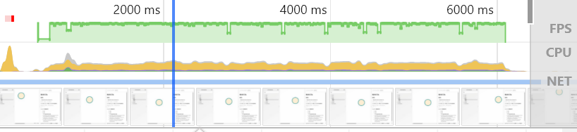
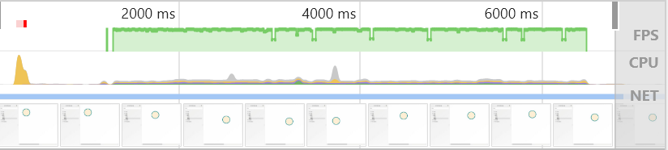

# 測試

### 結論

- 在處理動畫/事件上, 儘量使用 d3 來渲染, 而不要使用 react, 因為性能上有極大的差距

### 測試內容：畫面效果同基礎 1, 但是使用 d3 的方式來渲染畫面

詳見https://www.smashingmagazine.com/2018/02/react-d3-ecosystem/

文章作者指出: 在 React 上使用 D3 總共有四種方式，基礎 1 使用 React for the DOM, D3 for Math，也就是使用 React 來渲染 DOM, D3 只做計算

這種方式不是很好寫, 感覺每次都要在很多地方宣告變數, 好處是比較 react way

在 react way 上, 要使用 setState 來重新渲染畫面

我想要比較一下使用 react way 和 d3 way 在渲染畫面上的差別

### 測試方式

雙方各使用 chrome 的 performance 工具隨機拖曳約 5 秒

### 測試結果(storybook的markdown無法顯示圖片, 請至github上查看結果)

- 基礎 1(React WAY)
  
- 基礎 2(D3 WAY)
  

雖然測試方式不是很嚴謹, 但是可以看見結果相差懸殊
建議皆使用 d3 way 來處理動畫/事件
